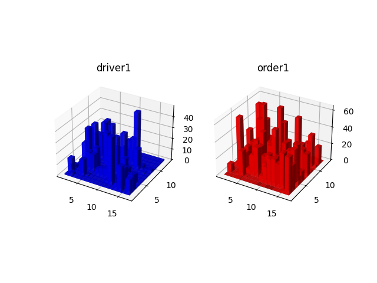
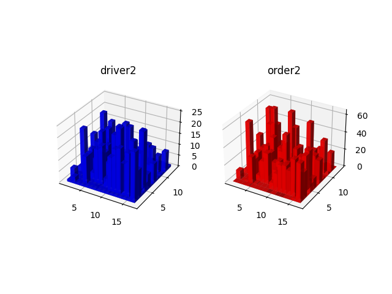

## <center>外卖调度算法——研究报告</center>

<center>魏衍芃, 2021010795</center>
<center>罗新阳, 2022013041</center>
<center>王奋岐, 2020013263</center>

### 研究主题 & 问题背景

外卖是生活中的常见场景，现如今，人们对外卖的需求也与日俱增。随之而来的，外卖平台需要利用有限的外卖人数应对与日俱增的外卖订单数量。

我们的基础场景为：有一个外卖平台作为服务端（server），与之对应的，有多个外卖员，他们的手机作为客户端（client）。

在此场景下，客户端的任务是为外卖员寻找最合适的路线，但是这是**旅行商问题**，并没有多项式算法，我们不进行深度的讨论。

服务端的任务是调度外卖员以及分配外卖员的订单。我们将站在**外卖平台**的角度，通过调度外卖员，使得服务端长期拥有更高的收益。

### 问题抽象 & 模型建立

我们期望从**外卖平台的角度**，使在最大限度优化平台利益的情况下，对外卖员进行调度。更准确地，我们将基于区域，对外卖员进行调度，使得平台在付出合理的代价的情况下，提升平台对高峰订单的承受能力。

对于其必要性，考虑到城市上下班高峰期与正常时间，饭店与平时的外卖订单分布是十分不同的，这会导致在不同的时间节点，外卖订单的分布可以有不同。问题是站在外卖员的角度，其操作通常是在同一区域进行抢单而不考虑长距离的移动，因为这样的操作不会影响外卖员的收益。但是对于平台来说，这会导致高峰区域的人手不足，导致配送时间加长，自身收益变低。由此以来，我们需要在**区域**间对外卖员进行调度。但是由此一来我们需要主动让外卖员移动，故对其移动，平台也需要进行收费。

#### 1. 城市的建立

我们将城市看作 $X \times Y$ 的二维平面，任意的位置都可以由 $(x, y) \text{ s.t. } 0 < x < X, 0 < y < Y$ 描述。

在此基础上，我们将对城市划分为若干个**区域**（$N\times M$）， 我们将不考虑区域内部的划分，而仅仅考虑区域外部的划分。

距离采用哈密顿路径：$\text{dist}((x,y), (z,w)) = |x-z|+|y-w|$

#### 2. 订单与外卖员的建模

外卖员仅由其位置组成，由 $(p_x, p_y)$ 表示。

每个订单都由两个位置组成，$(s_x, s_y)$, $(t_x, t_y)$ 分别表示外卖的店铺位置和外卖的送达位置。外卖员需要先到达店铺位置再到达送达位置。

我们这里将直接考虑送达位置（住户的位置），这是由于：将城市划分为若干区域后，绝大部分的外卖店铺都与送达位置距离不远，且我们将**只考虑区域间的调度**，故使用店铺位置并不会过多的影响整体调度。

**我们将不断统计最近的时段（例如，最近 10 分钟）的所有订单并且统计每个区域的订单分布，并以此分配外卖员。**

我们的算法将直接导入此数据，并且给出平台分配外卖员的方案以及我们建模的最小代价。

#### 3. 调度的方式

如前文所说，我们将只考虑区域间的调整，故我们规定调度的方式有且仅有**将一个外卖员从区域 $(i, j), i < N, j < M$ 送至 $(i, j)$ 的相邻区域（四联通），其距离将直接使用划分区域的中心之间的距离。

#### 4. 代价的确立

因为在不同时段中，订单的分布是不同的（因为各个地区由于工作性质等，其工作时间，高峰期都是不同的），我们将每 $10$ 分钟对外卖员进行动态的分布。

当我们得到了最近 $10$ 分钟的所有订单信息，我们将对外卖员的位置进行调整，外卖平台需要为外卖员位置的移动买单，我们额外增加一个系数 $\alpha$，故调整的花费将为：

$$
\alpha \times \sum_{i}^{n_\text{deliverer}} \text{path gone by $i$-th deliverer} 
$$

同时，若外卖员与外卖订单的分布不均，也将产生代价，因为平台并没有达到最优的收益。

对于不均程度，我们使用 KL 散度对外卖员 $P$ 与订单 $O$ 的分布的不均程度进行比较：

$$
KL(P \| O) = \alpha \times \sum_{i \in \text{regions of $N \times M$ }} \Pr(O_i) \log \frac{\Pr(O_i)}{\Pr(P_i)}
$$

$\Pr(O_i)$ 表示在第 $i$ 个区域 $(i_i, i_j)$ 中，订单的个数 $O_i$ 占所有订单的比例。对于 $P$ 同理。

我们同时约定 $P_i$ 无论如何必须 $\ge 1$，也即每个区域的

同时新增了 $\beta$ 系数，外卖员分布的代价将为：

$$
\beta \times \sum_{i \in \text{regions of $N \times M$ }} O_i \times KL(P \| O)
$$

所以总代价将为：
$$
\beta \times \left[\sum_{i \in \text{regions of $N \times M$ }} O_i\right] \times KL(P \| O) + \alpha \times \sum_{i}^{n_\text{deliverer}} \text{path gone by $i$-th deliverer} 
$$

### 算法阐述

我们的算法程序将直接读取 所有外卖员的位置 以及 所有订单的信息。

#### 1. 生成模拟数据

为了完成外卖调度算法的工作，需要准备地图与订单的数据。地图中的外卖员与订单位置采用随机算法生成其位置，随机生成点的算法有以下两种：
- **直接泊松采样：**用于生成平面内均匀分布的大量随机点，需要的参数有地图尺寸 $(X_\mathrm{max}，Y_\mathrm{max})$ 与随机点间距 $d$，该算法的优势为平面内随机点分布均匀且可以通过修改参数来控制点的密度，缺点为无法精确控制点的数量。
- 聚落式随机点：先在地图上生成少量聚落，为了使聚落均匀分布减少重叠，采用了泊松采样算法，获得聚落中心与聚落范围后，采用高斯分布的随机数在聚落中心附近生成点。使用该方法可以模拟实际问题中的商圈、小区等订单密集的区域。
在调试过程中，为了直观体现随机地图的生成结果，还在地图类中添加了可视化功能，将生成的不同类型的点（外卖员、订单等）以不同颜色绘制在一张图片中，并将聚落范围也展现在图上。根据绘制结果调整随机点生成所需参数，即可得到满意的结果。

具体代码可见 ```src/map/RandMap.cpp/hpp```


#### 2. 计算最小代价

计算最小代价中，我们用了爬山法。其基本思想是不断进行随机调整，遇到最小调整则采用，否则不采用，并且调整的程度越来越小。

我们的实现的伪代码：

```
FOR 若干阶段
  进行若干次调整（调整次数逐次递增）
  确定一次调整的人数（人数逐次递减）
  FOR 调整次数
    随机一次调整，查看这次调整是否可行（是否有足够的人能移动到下一个区域）
    （调整可以是撤销之前的移动）
    若可行，操作调整并且更新当前人数分布，记录代价
  END FOR
END FOR
```

具体可以见 ```src/zone/zone.cpp >> ZoneMap::balance``` 函数。

#### 3. 视觉呈现

在python实现画图上，主要使用了python中的绘图工具matplotlib。具体思路是首先将已经得到的数据读入，这里我使用了numpy来读入，接着分别存取进drivers分布和orders分布。将这些分布理解成一个二维的平面图，每个坐标对应的函数值就是这个坐标处的小矩阵对应的高度。按照这样的思路，就只需要按照一般构建网格图的步骤，先展开获得x和y方向的网格图，然后再绘制三维柱状图即可，稍微调整一下参数即可完成绘图工作。

具体代码可见 ```plot.py```，需要手动替换 ```data1``` 和 ```data2```。

### 最终结果


Before:


```c
alpha = 0.01
beta = 1.0
random seed = 1703604914
base cost = 2533.77 // initial cost, i.e. only KL divergance * beta
```


After:


```c
final cost = 434.107 // final cost:
                     // KL divergance * beta + distance * alpha
```

可以看到，我们的实现让骑手的分布显著地向订单分布靠拢，显著增加了平台收益。

### 参考资料

- 爬山算法：[wikipedia](https://en.wikipedia.org/wiki/Hill_climbing)
- KL 散度：[wikipedia](https://en.wikipedia.org/wiki/Kullback-Leibler_divergence)